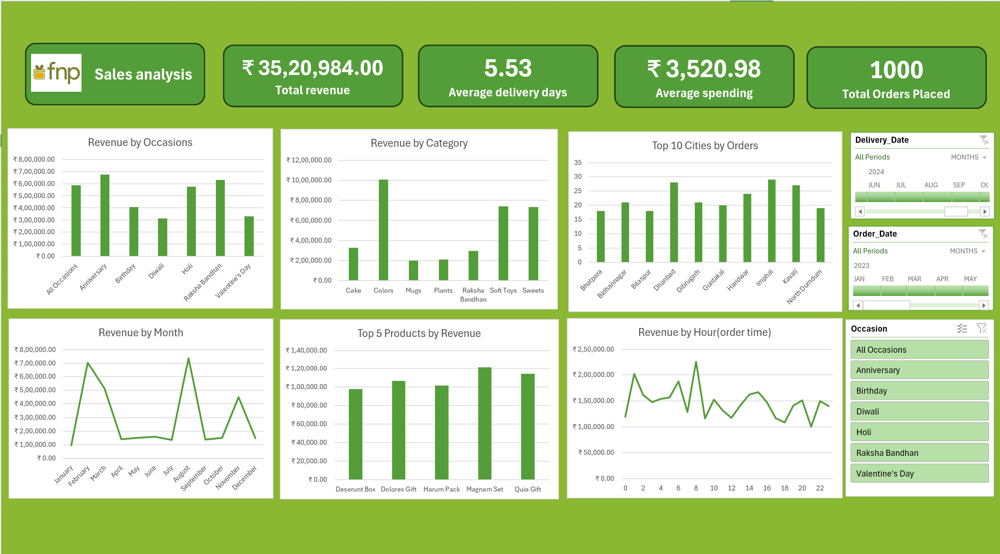

# Ferns N Petals (FNP) Sales & Operations Analysis

## 🎯 Problem Statement
Ferns N Petals required a consolidated view of their sales performance and delivery operations to better understand purchasing behaviors. The objective of this project was to analyze order trends across various occasions, product categories, and geographical regions to optimize marketing strategies and improve delivery efficiency.

## 📌 Project Overview
This project features a comprehensive, interactive Excel dashboard and a detailed analytical report built from raw transactional data. It tracks over ₹35.2 Lakhs in revenue across 1,000 distinct orders, uncovering actionable trends in customer spending, delivery timelines, and seasonal purchasing peaks.

## 📊 Dashboard Preview

## 📂 Repository Contents
* **`Ferns and Petals Sales Analysis.pdf`**: The complete analytical report containing the detailed problem statement, KPIs, trend plots, and final business recommendations.
* **`Dashboard.png`**: High-resolution screenshot of the interactive Excel dashboard.
* **`fnp datasets/`**: The raw data folder used to build the relational data model, containing:
  * `orders.csv` (Fact Table): Transactional data, order/delivery dates, and revenue metrics.
  * `customers.csv` (Dimension Table): Customer demographics and geographical data.
  * `products.csv` (Dimension Table): Product catalogs, pricing, and occasion categories.

## 🛠️ Tools & Techniques Used
* **Data Cleaning & Transformation:** Microsoft Excel, Power Query
* **Data Modeling:** Relational mapping of CSV files, Pivot Tables, Aggregations
* **Visualization:** Dynamic Charts (Line, Bar), Timelines, and Interactive Slicers

## 💡 Key Business Insights
* **High-Level KPIs:** The business generated **₹35,20,984** in total revenue from **1,000 orders**, with an average order value (AOV) of **₹3,520.98**. The average delivery time stands at **5.53 days**.
* **Top Revenue Drivers by Occasion & Category:** "Anniversary", "Holi", and "Raksha Bandhan" are the most profitable occasions. Unsurprisingly, "Colors", "Soft Toys", and "Sweets" make up the highest-grossing product categories.
* **Seasonal Sales Peaks:** Revenue trends show distinct spikes in February (Valentine's week), July, and late-year festive months (October/November).
* **Geographical Demand:** Tier-2 and Tier-3 cities like Dhanbad, Haridwar, and Kavali showed strong order volumes, indicating a wide geographic reach beyond major metros.
* **Order Time Behavior:** Purchasing activity shows strong spikes during early morning hours (around 8 AM) and late evening.

## 🚀 How to View 
1. Click on the `Ferns and Petals Sales Analysis.pdf` file above to read the detailed problem statement and analytical report directly in your browser.
2. The raw datasets (`customers.csv`, `orders.csv`, `products.csv`) can be explored inside the `fnp datasets/` folder.
